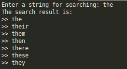

# AUTO-COMPLETE AND AUTO-SUGGEST(C++)
Implemented the auto-suggest feature using Trie Data structure, which gives all posssible completion options based on user input. If user want to delete some word from his data base he also can perform that deletion operation.

